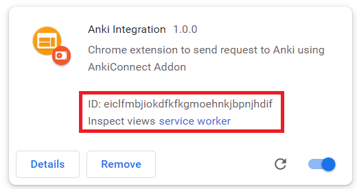

# Anki-Integration

Chrome extension to call [AnkiConnect's supported actions](https://github.com/FooSoft/anki-connect) from web pages.


## Sample action
### View AnkiConnect version
```js
let extensionId = "fblpcgabhcmmbmdackhodlfcodjfalan";  // Note: insert id for imported 'anki-integration' extension

chrome.runtime.sendMessage(
    id,
    {
        contentScriptQuery: "ankiConnect",
        actionData: { "action": "version", version: 6 }
    },
    response => {
        console.log(response);
    });
```

### Get all decks name
```js
let extensionId = "fblpcgabhcmmbmdackhodlfcodjfalan";  // Note: insert id for imported 'anki-integration' extension

chrome.runtime.sendMessage(
    id,
    {
        contentScriptQuery: "ankiConnect",
        actionData: { "action": "deckNames", version: 6 }
    },
    response => {
        console.log(response);
    });
```

## Note
- The `extensionId` is id of the imported 'anki-integration' extension

    </img>

- Change `actionData` with the [AnkiConnect's supported actions](https://github.com/FooSoft/anki-connect#supported-actions).
- Change urls in `matches` in `manifest.json` file for other url
```json
    "externally_connectable": {
        "matches": [
            "https://krmanik.github.io/*"
        ],
        "accepts_tls_channel_id": false
    },
```

## License
### [anki-integration]()
[GNU Affero General Public License v3](https://opensource.org/licenses/AGPL-3.0)
<br>Copyright (c) 2021 Mani